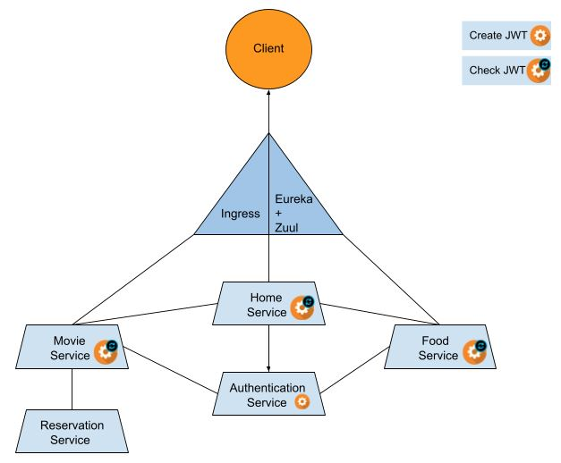

# cinema_microservices

<p align="center">
  <a aria-label="cinema_microservices license" href="https://github.com/Rubinjo/cinema_microservices/blob/main/LICENSE" target="_blank">
    
  </a>
  <a aria-label="Gradle project" href="https://github.com/gradle/gradle" target="_blank">
    
  </a>
  <a aria-label="Spring Boot project" href="https://github.com/spring-projects/spring-boot" target="_blank">
    
  </a>
</p>

This project was executed as a school assignment at the University of Twente. The project consist of multiple microservices that work together to form the online business of a typical cinema:movie_camera:. The services are mainly build with [Spring Boot](https://github.com/spring-projects/spring-boot) as its backbone, which is supported by html and css for the front-end. The application has been build to work both locally and also containerized in [Kubernetes](https://github.com/kubernetes/kubernetes).

## Project Overview

- School: University of Twente
- Course: Service-oriented architecture with Web services
- Assignment Type: Open Project
- Group Size: 2

## Services

- Eureka Discovery Server
- Zuul API Gateway
- Home Service
- Authentication Service
- Movie Service
- Food Service
- Reservation service

<p align="center">
  
</p>

## Setup (`for Windows`)

1. Setup your own email-client for the reservation service by editing the [application.properties](https://github.com/Rubinjo/cinema_microservices/blob/main/reserve-service/src/main/resources/application.properties) of this service (without this step the service will not work, but others will still function)

### Locally

2. Run setupLocal.sh (wait for all services to boot up)
```
cd cinema_microservices
setupLocal.sh
```
3. (Optionally) Open the Eureka server 
```
https://localhost:8761
```
4. Navigate through the website on port 8080
```
https://localhost:8080
```

### Containerized (`for Minikube`)

The containerized setup will create (and delete) a completely new Minikube cluster. If you already have a cluster running you first have to delete this to get the setup to work. The services can also be implement on an existing cluster, however these steps are not provided here.

2. Run setupContainer.sh (wait for it to finish)
```
cd cinema_microservices
setupContainer.sh
```
3. Apply the ingress controller to the cluster
```
kubectl apply -f ingress.yml
```
4. (Optionally) Open the Minikube dashboard
```
minikube dashboard
```
5. Get the Minikube ip address
```
minikube ip
```
6. Add the found minikube ip and the domain name cinetopia.ut to your /etc/hosts file:
```
minikubeIp cinetopia.ut
```
7. Navigate through the website on cinetopia.ut

## Shup down

### Locally

1. Stop all process (CTRL+C) that were started by executing setupLocal.sh

### Containerized

1. Stop Minikube
```
minikube stop
```
2. Delete the Minikube cluster
```
minikube delete
```
